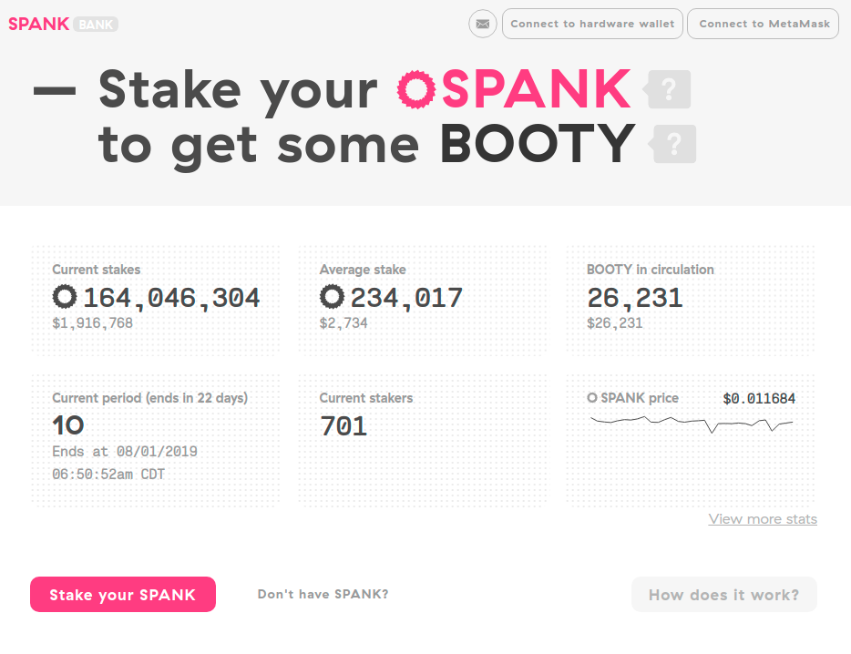

# The SpankBank 🏦

!!! Important
    **Before you Stake**: Please read and understand the following SpankBank quirks and caveats! Staking in the SpankBank ***requires active participation***.

    - An address can only stake **once**. Ever.
    - The SpankBank and every staker operate on the same global clock broken into **30-day periods**.
    - Your stake will begin at the start of the **following** period.
    - You **cannot** withdraw SPANK at any point during the stake.
    - Check-ins begin at the start of the **following** period.
    - You **must** have checked-in for the period to be able to claim its BOOTY.
    - Check-ins require an Ethereum transaction (and its fee), but you can also extend your stake in that same transaction.
    - The amount of SPANK counted towards your stake will drop 5% each period _unless_ you choose to extend your stake when checking in.
    - Staking longer will allow more of your SPANK to be counted towards the stake. (See [SpankPoints](#spankpoints))

## SpankBank Overview

### SpankPoints

| Stake Duration (Periods)    | % of SPANK counted       |
| :-------------------------: | :----------------------: |
|            12               |             100%         |
|            11               |              95%         |
|            10               |              90%         |
|             9               |              85%         |
|             8               |              80%         |
|             7               |              75%         |
|             6               |              70%         |
|             5               |              65%         |
|             4               |              60%         |
|             3               |              55%         |
|             2               |              50%         |
|             1               |              45%         |

In order to earn the maximum BOOTY 🍑, a staker would need to stake for 12 periods, and then opt to extend their stake by 1 period during every check in.

If a staker stakes for 12 periods but doesn't opt to extend their stake during check ins, they would receive 100% of the BOOTY 🍑 for the first period, 95% for the second period, and so forth until they receive 45% during the final period.

### 🔥🍑🔥 BOOTY Burns 🔥🍑🔥

| Period   | 🔥🍑🔥       |
| :-------------------------: | :----------------------: |
|            0               |                       |
|            1               |                       |
|            2               |                       |
|            3               |                       |
|            4               |                       |
|            5               |                       |
|            6               |                       |
|            7               |                       |
|            8               |                       |
|            9               |                       |